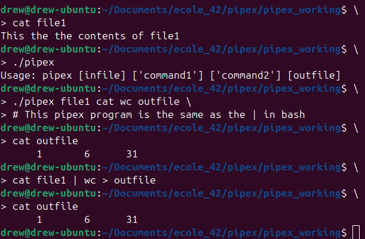

# Pipex

Pipex is a C systems programming project that recreates shell pipe behavior from the command line. Given an input file, two or more commands, and an output file, the program launches the commands as child processes and connects them with Unix pipes so the output of one command becomes the input of the next.



This was a solo school project completed over one month, from April 2023 to May 2023. Final grade: 125/100, with all bonus requirements completed.

## What It Does

The mandatory version mirrors a two-command shell pipeline:

```sh
< infile cmd1 | cmd2 > outfile
```

Run through Pipex as:

```sh
./pipex infile "cmd1" "cmd2" outfile
```

Example:

```sh
./pipex file1 "cat -e" "wc -l" outfile
```

The bonus version supports longer command chains:

```sh
./pipex_bonus infile "cat" "grep hello" "wc -l" outfile
```

It also supports `here_doc`, which reads input from the terminal until a limiter word is entered and appends the result to the output file:

```sh
./pipex_bonus here_doc END "cat" "wc -l" outfile
```

## Why This Project Is Challenging

Although the user-facing behavior looks like one shell command, implementing it in C requires manually coordinating several operating system features that the shell normally hides:

- **Process creation:** each command is executed in a separate child process using `fork`.
- **Program replacement:** child processes become real shell commands with `execve`.
- **Pipe wiring:** file descriptors must be duplicated with `dup2` so every command receives input from the correct source and writes to the correct destination.
- **File descriptor cleanup:** unused pipe ends must be closed in both parent and child processes to avoid hangs, leaks, and incorrect EOF behavior.
- **PATH lookup:** commands like `cat` or `wc` must be resolved against the system `PATH`, while absolute paths such as `/usr/bin/wc` must also work.
- **Error handling:** missing files, invalid commands, bad permissions, failed forks, and failed pipes all need predictable behavior.
- **Memory management:** command arguments, resolved paths, process IDs, and temporary resources are allocated and freed manually.

These are common pain points for students because small mistakes can create bugs that are hard to see: a pipeline may hang forever because one descriptor stayed open, a child may inherit the wrong input, or a failed command may leave allocated memory or temporary files behind.

## Project Structure

```text
pipex_working/
  Makefile
  mandatory/
    includes/pipex.h
    srcs/
  bonus/
    includes/pipex_bonus.h
    srcs/
  libft/

pipex_testing/
  test scripts and sample files
```

`libft` is a custom C utility library used across the project for string handling, linked lists, formatted output, and line reading.

## Build

From the implementation directory:

```sh
cd pipex_working
make
```

Build the bonus executable:

```sh
make bonus
```

Clean generated files:

```sh
make fclean
```

## Implementation Notes

The main state is stored in a `t_pipex` structure that tracks the current pipe, previous pipe, command index, process IDs, arguments, environment, resolved command path, and split command arguments. The fork loop creates one child per command, connects the child to either the input file, previous pipe, next pipe, or output file, then waits for all children before final cleanup.

The bonus version extends the same model to an arbitrary number of commands and adds `here_doc` support by collecting terminal input into a temporary file before running the pipeline.
